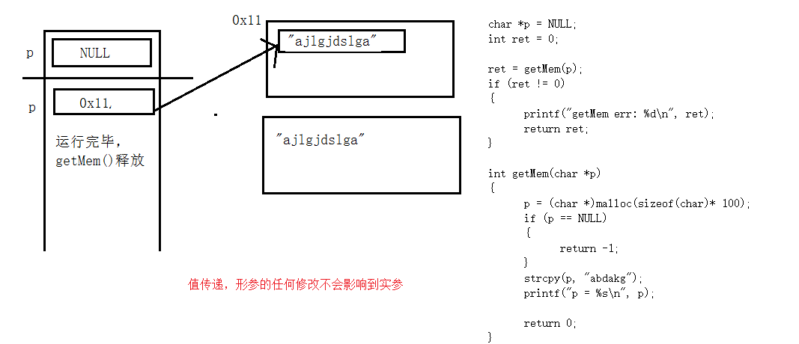
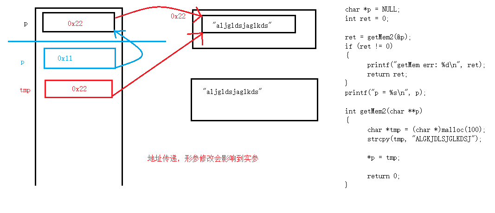
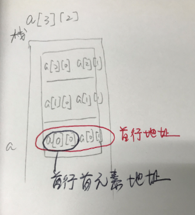

# 多级指针和多维数组
## const的使用  
const修饰一个变量为只读  
```
const int a = 100;
a=100;   //err, 无法更改a的值
```
```
char buf[] = "abcd";
const char *p = buf;  //等价于char const *p1 = buf;
```
怎样分辨是指针常量还是常量指针？  
从左往右看，去掉类型，看const修饰什么，如果是※（常量指针，const+※），不能通过指针来修改内存的值  
```
const char *p = buf；//不能通过*p来修改buf的值，但是可以修改指针p(即让他指向别的内存)，也可以直接修改buf的值
```
如果修饰指针变量（指针常量，※+const），说明指针不能修改，即指针的指向不能修改  
```
char * const p = buf; //指针p只能指向buf，不能指向其他内存
```
const既修饰※又修饰指针  
```
const char * const p = buf;
```
c语言中的const是一个冒牌货，可以通过指针进行修改  
```
const int b = 10;
b = 20; //err
int *p = &b;
*p = 20; //ok
```
## 二级指针
值传递与地址传递比较  
  
  
### 二级指针做输入的三种内存模型：  
#### 指针数组
```
//指针数组：指针的数组，每一个元素都是指针
char *p[] = {"abc","def","ghi"};  
char **p = {"abc","def","ghi"};  //err 注意*p[]与**p的区别，**p是一个指针不能指向多个内存，但是可以指向*p[]的首地址
//char *p[5] = {"abc","def","ghi"};  //指定数组长度
int i =0;
int n = sizeof(p)/sizeof(p[0]);
for(i=0;i<n;i++)
{
  printf("%s\n",p[i]);
}
```
注：上述程序中没有指定指针数组的长度，因此可以用sizeof的方式得到数组中的元素个数，如果指定了数组的长度，就不能用sizeof的方式（之前编程也遇到过这种情况）  
注意※p[]与※※p的区别，※※p是一个指针不能指向多个内存，但是可以指向※p[]的首地址，但是在定义函数参数中，※p[]与※※p是等价的  
```
void prr(int p[]);
void prr(int *p);   //等价
```
```
void prr(int *p[]);
void prr(int **p);   //等价
```
#### 二维数组  
1 二维数组在内存中的存放方式：按行存储  
例如：a[3][2]这个二维数组，其在内存中存储顺序为：  

a[0][0] a[0][1]     //先存储第一行   
a[1][0] a[1][1]     //再存储第二行  
a[2][0] a[2][1]     //再存储第三行  
    
2 注意：二维数组的定义，第一维可以不写(条件：必须要初始化)  
```
char a[3][30] = {"22222","aaaaa","dddddd"};
char a[][30] = {"22222","aaaaa","dddddd"};
char a[][30];  //err
```
3 a代表首行地址，和首行首元素地址有区别（加一步长不同），但是值是一样的  
首行地址a+1：跳30个字节  
首行首元素地址&a+1:跳1个字节  
#### 在堆中分配空间  
```
char **p = NULL;
p = (char **)malloc(10 * sizeof(char *));
for(int i = 0; i < 10; i++)
{  
  p[i] = (cahr *)malloc(30 * sizeof(char));   
}
```
## 多维数组
### 回顾一维数组
```
int a[] = {1,3,5,7,8};
int b[];  //err 一维数组定义时必须要初始化
int c[100] = {1,2,3,4};  //没有赋值的都是0
//无论是数组定义还是变量定义，原则上是要确定内存的大小，否则就会出错

int n1 = 0;
int n2 = 0;
int i = 0;
//sizeof(a) = 4*5 =20
n1 = sizeof(a)/sizeof(a[0]);  //n1=5
//数组c的大小已经确定了，用以下方式无法求出数组中实际存在的数量
n2 = sizeof(c)/sizeof(c[0]);  //n2=100

for(i = 0; i < n1; i++)
{
  printf("%d",a[i]);
  //printf("%d",*(a+i));//等价
}
```
通过typedef定义一个数组类型，再通过数组类型定义一个变量  
怎样确定定义的变量b的类型？去掉typedef，把b替换到A的位置   
```
typedef int A[8];  //代表数组类型
A b；//通过数组类型定义变量，等价于int b[8]
```
### 指针数组与数组指针 
指针数组：本质是数组，数组中的每个元素都是指针  
```
//指针数组
//[]优先级高于*
char *a[] = {“abc”,“dgh”}
```
数组指针：本质是指针，指向一个数组的首地址，而不是首元素地址    
```
//方法一：先定义数组类型，再根据类型定义指针变量
typedef int A[10];
A *p = NULL;  //p：数组指针类型变量
int a[10] = {0};
p = &a;  //&a代表整个数组首地址
//p =a;  //a代表首元素地址，会有警告
```
```
//方法二：先定义数组指针类型，再根据类型定义变量
//和指针数组写法类似，但是多了()
//()和[]优先级一致，所以从左往右
typedef int (*P)[10];  //指向数组的指针，但因为有typedef，所以是一个数组指针类型
P q； //定义数组指针变量q
```
```
//方法三：
int(*q)[10];  //指向有10个元素的数组的指针
q = &a； //q指向a数组
```
### 回顾二维数组
二维数组的定义：  
```
//a[x][y]就是x行y列
//方法一：
int a[3][4] = {
  {1,2,3,4}，
  {5,6,7,8}，
  {3,5,6,8}
}；
```
```
//方法二（常用）：
int a[3][4] = {{1,2,3,4}，{5,6,7,8}，{3,5,6,8}}；
```
```
int a[][4] = {1,2,3,4,5,6,7,8,3,5,6,8}；//行可以不写
```
二维数组的打印:  
```
int i = 0;
int j = 0;

for(i=0;i<3;i++)
{
  for(j=0;j<4;j++)
    {
      printf("%d", a[i][j]);
    }
    printf("\n");
}
```
数组的地址问题：  
```
int a[][4] = {1,2,3,4,5,6,7,8,3,5,6,8}；
//a:  第0行地址
//a+i：  第i行地址
//*(a+i):  第i行首元素地址
//*(a+i)+j:  等价于&a[i][j]  第i行j列元素的地址
//*(*(a+i)+j):  等价于a[i][j]  第i行j列元素的值
```
原则：数组名为第0行首地址；要想把首地址转化为首元素地址，加※；要想得到某个元素地址，加偏移量；要想得到某个元素的值，在这个元素地址的基础上再加※  

### 数组指针与二维数组结合使用


